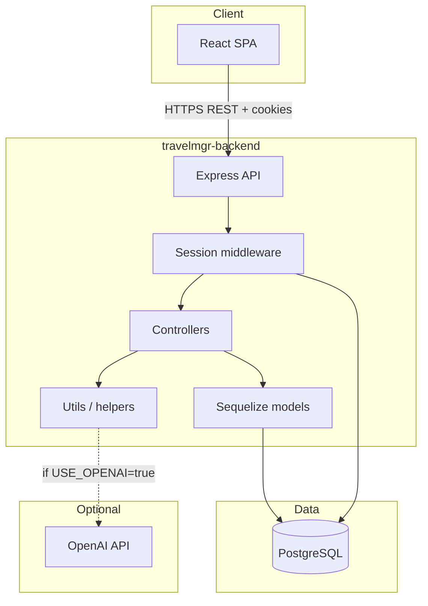
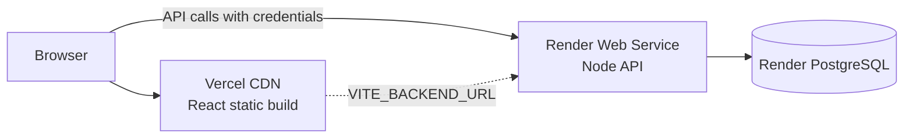
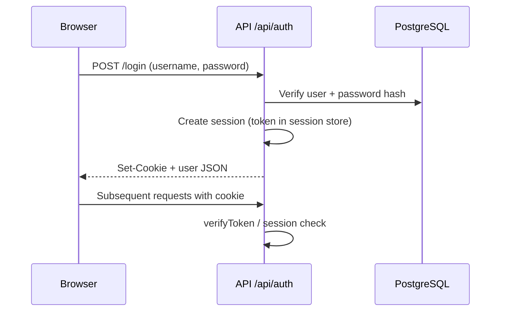

# Architecture

## Overview

Travel Manager is a full-stack trip-planning application. Users create **trips**, split them into **stages** (locations or date ranges), and attach **activities** (flights, hotels, restaurants, etc.). Data can be imported from **ICS** or **CSV** files, and optional **AI document import** extracts booking information from uploaded files.

## Functional scope

| Area | Capabilities |
|------|----------------|
| Authentication | Register, login, session-based auth, profile, password change |
| Trips | CRUD, unique trip names |
| Stages | CRUD per trip, merge consecutive stages |
| Activities | CRUD, type-specific fields, timeline view, duplicate detection |
| Import | ICS calendar, structured CSV export format |
| AI import | Upload PDF/image/text, review proposed actions (pattern-based or OpenAI) |
| AI trip planning | Form-based preferences → synthesis → itinerary → create trip (OpenAI or fallback) |
| i18n (UI) | English, French, Spanish, Dutch (frontend translations) |

## Technology stack

| Layer | Technology |
|-------|------------|
| Frontend | React 18, TypeScript, Vite, Material UI, Axios |
| Backend | Node.js 18+, Express 4, express-session |
| Database | PostgreSQL 15 |
| ORM / migrations | Sequelize 6, Umzug |
| Auth | bcrypt password hashing, server-side sessions (PostgreSQL store in production) |
| Quality | ESLint, Node.js test runner, Supertest, SonarCloud |
| Hosting | **Default:** Render (API + DB), Vercel (frontend). **On-demand:** Firebase Hosting + Cloud Run + Cloud SQL |

## Logical architecture

## Deployment architecture

Optional second environment (manual deploy only): Firebase Hosting + Cloud Run + Cloud SQL. See [06-deployment.md](06-deployment.md#gcp-on-demand-firebase-hosting--cloud-run--cloud-sql).

| Component | Role |
|-----------|------|
| **Vercel** | Builds and serves the Vite SPA; SPA routing via `vercel.json` rewrites |
| **Render Web Service** | Runs `npm start` from `travelmgr-backend/`; health check on `/api/health` |
| **Render PostgreSQL** | Primary data store; `DATABASE_URL` injected via Blueprint |
| **GitHub Actions** | Lint, test, coverage upload; SonarCloud analysis on `main`; optional `deploy-gcp.yml` on `workflow_dispatch` |

## Main request flows

### Authentication

The frontend uses `axios` with `withCredentials: true`. In production, cookies use `secure` and `sameSite: none` for cross-origin Vercel → Render.

### Trip import (ICS)

1. Frontend sends `POST /api/import` with `icsContent` and optional `tripName` / `tripId`.
2. Backend parses events (`ics-import-helpers`), creates or updates trip, creates stages and activities.
3. Countries reference data (e.g. South Africa `ZA`) links stages to geography.

### CSV import

1. `POST /api/trips/:id/import-csv` with `csvContent` body.
2. `csv-import-helpers` parses rows, merges hotel check-in/out lines, groups stages.
3. Stages and activities persisted via Sequelize.

### AI trip planning

1. User opens the **Plan Trip with AI** wizard from the trip list.
2. Frontend saves preferences via `POST /api/ai-planning/sessions`.
3. Backend validates coherence (`validate`) and returns a synthesis for confirmation.
4. On confirmation, backend generates an itinerary (OpenAI if enabled, else rule-based fallback).
5. User accepts, revises (with text feedback), or rejects.
6. On accept, backend creates Trip + Stages + Activities; session status becomes `accepted`.
7. Sessions are stored in `trip_planning_sessions` for history and resume.

See [07-api-reference.md](07-api-reference.md#ai-trip-planning--ai-planning) for endpoint details.

## Key design decisions

| Decision | Rationale |
|----------|-----------|
| Monorepo (backend + frontend folders) | Single repo, shared CI, aligned releases |
| Session auth vs pure JWT in browser | Simpler SPA integration with httpOnly cookies; JWT also stored in session for verify middleware |
| Migrations on startup | `connectToDatabase()` runs Umzug migrations before serving traffic |
| Helper modules for imports | Pure functions testable without HTTP; controllers stay thin |
| SonarCloud quality gate | Enforces coverage and security rules on `main` |

See [decisions/](decisions/) for formal ADRs.

## Security highlights

- Passwords hashed with bcrypt; never logged (see `log-sanitizer`, secure logger).
- Express `x-powered-by` disabled.
- CORS restricted to configured origins plus `*.vercel.app` / `*.onrender.com`.
- Docker production image runs as non-root user `nodejs` (UID/GID 1001).
- File uploads limited (5 MB) on AI import routes.

## Constraints and limits

| Item | Note |
|------|------|
| Render free tier | Cold starts, resource limits |
| OpenAI | Optional; pattern fallback when disabled or unavailable |
| Frontend tests | Lint + TypeScript + build only; no Vitest suite yet (see [04-testing-strategy.md](04-testing-strategy.md)) |

## Extension points

- Enable OpenAI (`USE_OPENAI=true`, `OPENAI_API_KEY`, optional `OPENAI_MODEL`) for richer document parsing and AI trip planning.
- Add E2E tests (Playwright/Cypress) against staging.
- Complete PDF/OCR pipeline in `ai-import` (currently stubbed for some MIME types).
- Phase 2 docs: user manual, database reference, contribution guide.
