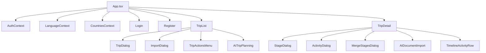

# Source Code Structure

## Repository layout

```
Travel-manager/
├── README.md                 # Project overview (links to documents/)
├── documents/                # Maintained project documentation
├── tools/                    # PowerShell DX scripts (DB reset, Docker, GCP)
├── infra/                    # Optional cloud templates (e.g. Azure Bicep)
├── docs/                     # Legacy / archive (not primary docs)
├── render.yaml               # Render Blueprint (API + PostgreSQL)
├── docker-compose*.yml       # Local / Sonar stacks
├── azure-pipelines.yml       # Optional Azure DevOps CI
├── sonar-project.properties  # SonarCloud analysis config
├── .github/                  # Actions, Dependabot, issue/PR templates
├── tests/                    # Shared test fixtures (e.g. sample CSV)
├── travelmgr-backend/        # Node.js / Express API
└── travelmgr-frontend/       # React / Vite SPA
```

## Backend (`travelmgr-backend/`)

```
travelmgr-backend/
├── index.js              # HTTP server entry (listen on PORT)
├── app.js                # Express app: middleware, routes, DB connect
├── Dockerfile            # Production container (non-root user)
├── dev.Dockerfile        # Development container
├── package.json
├── .env.example
├── controllers/          # Route handlers (Express routers)
├── models/
│   └── DBmodels.js       # Sequelize models + associations
├── migrations/           # Umzug migration scripts (ordered by filename)
├── utils/                # Shared backend logic
└── tests/                # Automated tests (*.test.js)
```

### Controllers (active routes)

Mounted in `app.js`:

| File | Mount path | Responsibility |
|------|------------|----------------|
| `users.js` | `/api/auth` | Login, register, profile, logout, verify |
| `trips.js` | `/api/trips` | Trip CRUD, CSV import |
| `stages.js` | `/api/stages` | Stage CRUD, merge |
| `activities.js` | `/api/activities` | Activity CRUD, timeline, duplicates, structure-trip |
| `countries.js` | `/api/countries` | Country list with translations |
| `languages.js` | `/api/languages` | Language reference CRUD |
| `activityTypes.js` | `/api/activity-types` | Activity type reference |
| `transportTypes.js` | `/api/transport-types` | Transport types |
| `accommodationTypes.js` | `/api/accommodation-types` | Accommodation types |
| `expenseCategories.js` | `/api/expense-categories` | Expense categories |
| `notificationTypes.js` | `/api/notification-types` | Notification types |
| `import.js` | `/api/import` | ICS trip import |
| `ai-import.js` | `/api/ai-import` | Document upload + AI/pattern analysis |
| `ai-planning.js` | `/api/ai-planning` | AI trip planning wizard (form → synthesis → itinerary → create trip) |
| `ai-adapt.js` | `/api/ai-adapt` | AI trip adaptation sessions |
| `admin.js` | `/api/admin` | Admin trips, AI logs, user management (admin role) |

Standalone `login.js` exists for historical tests only; production auth is in `users.js` (`/api/auth`).

### Utils

| Module | Purpose |
|--------|---------|
| `db.js` | Sequelize connection, Umzug migrations on connect |
| `config.js` | Environment config, safe DB log context |
| `middleware.js` | Request logger, error handler, token/session extractor |
| `logger.js` | Secure logging API (`info`, `infoWithCounts`, `infoWithContext`, `error`) |
| `log-sanitizer.js` | Redact secrets and connection URLs in logs |
| `ics-import-helpers.js` | Parse ICS, map events → activities/stages |
| `csv-import-helpers.js` | Parse CSV export format, hotel grouping |
| `activity-update-helpers.js` | Hotel date sync, grouped activity updates |
| `ai-service.js` | Pattern-based and optional OpenAI reservation parsing |
| `ai-planning-service.js` | Form validation, synthesis, itinerary generation (OpenAI + fallback) |
| `database-url.js` | Postgres URL normalization (Cloud SQL socket paths) |
| `trip-ownership.js` / `trip-access.js` | Unified trip ownership and access checks |
| `read-only-guard.js` | Block mutating API calls for read-only JWT sessions |
| `auth-helpers.js` | `requireAuth`, `requireAdmin`, user payload |

### Tests

Backend tests live under `travelmgr-backend/tests/` (~50 `*.test.js` files): auth, trips, stages, activities, import, admin, read-only users, AI planning/adapt, consistency, middleware, and helpers. See [04-testing-strategy.md](04-testing-strategy.md). Frontend Vitest tests are under `travelmgr-frontend/src/**/*.test.ts`.

## Frontend (`travelmgr-frontend/`)

```
travelmgr-frontend/
├── index.html
├── vite.config.ts
├── vercel.json
├── package.json
├── src/
│   ├── main.tsx              # React entry
│   ├── App.tsx               # Auth gate, trip list / detail routing
│   ├── types.ts              # Shared TypeScript interfaces
│   ├── constants.ts
│   ├── translations.ts       # i18n strings (en, fr, es, nl)
│   ├── utils.ts
│   ├── contexts/
│   │   ├── AuthContext.tsx
│   │   ├── CountriesContext.tsx
│   │   └── LanguageContext.tsx
│   ├── services/
│   │   ├── auth.ts           # Axios instance + auth API
│   │   ├── ai-planning.ts    # AI trip planning API
│   │   └── trips.ts          # Trip/stage/activity API calls
│   ├── components/
│   │   ├── Login.tsx
│   │   ├── Register.tsx
│   │   ├── UserProfile.tsx
│   │   ├── AIDocumentImport.tsx
│   │   ├── AITripPlanning/     # AI trip planning wizard
│   │   ├── TripList/         # List, dialogs, CSV export, import
│   │   └── TripDetail/       # Stages, activities, timeline, merge
│   └── utils/
│       └── dateTimeInputHelpers.ts
└── dist/                     # Production build output (generated)
```

### UI module map



### Frontend ↔ backend communication

- Base URL: `import.meta.env.VITE_BACKEND_URL` (default `http://localhost:3001/api`).
- All API calls use cookies (`withCredentials: true`).
- Types in `types.ts` mirror API JSON shapes.

## Cross-cutting configuration

| File | Scope |
|------|--------|
| `sonar-project.properties` | SonarCloud sources, exclusions, LCOV path |
| `.github/workflows/ci.yml` | Backend job, frontend job, SonarCloud job |
| `render.yaml` | Production backend + database |
| `travelmgr-frontend/vercel.json` | SPA build and rewrites |

## Naming conventions

| Element | Convention |
|---------|------------|
| Backend files | `camelCase.js` or `kebab-case` for multi-word helpers |
| React components | `PascalCase.tsx` |
| Tests | `*.test.js` under `travelmgr-backend/tests/` |
| Migrations | `YYYYMMDD_NN_description.js` |
| API routes | kebab-case path segments (`/api/activity-types`) |

## Code to avoid in new features

- Prefer `utils/logger.js` over raw `console.log` for application logs.
- Add tests alongside new helpers (`tests/<module>.test.js`) or integration tests for new routes.
