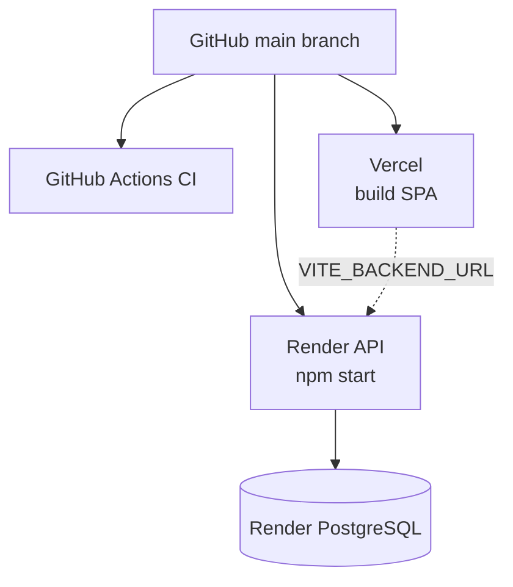

# Deployment

## Overview

| Environment | Frontend | Backend | Database |
|-------------|----------|---------|----------|
| Local | Vite dev server (`:5173`) | Node (`:3001`) | Local PostgreSQL |
| Production | Vercel | Render Web Service | Render PostgreSQL |



## Render (backend + database)

### Blueprint

The repository includes [`render.yaml`](../render.yaml):

- **Database:** `travel-mgr-db` (free plan)
- **Web service:** `travel-manager-api`
  - `rootDir`: `travelmgr backend`
  - `buildCommand`: `npm ci --omit=dev`
  - `startCommand`: `npm start`
  - `healthCheckPath`: `/api/health`

### First-time setup

1. Connect GitHub repo at [Render Blueprints](https://dashboard.render.com/blueprints).
2. Apply blueprint — Render creates DB and web service.
3. After Vercel deploy, set **`CORS_ORIGINS`** on the Render service to your frontend URL(s):

```
https://your-app.vercel.app
```

4. `SECRET` is auto-generated; `DATABASE_URL` is wired from the database resource.

### Environment variables (Render)

| Variable | Source | Notes |
|----------|--------|-------|
| `NODE_ENV` | Blueprint | `production` |
| `DATABASE_URL` | Linked DB | SSL handled in session store config |
| `SECRET` | Generated | Session signing |
| `CORS_ORIGINS` | Manual | Required for browser access from Vercel |
| `USE_OPENAI` | Blueprint | Default `false` |
| `OPENAI_API_KEY` | Optional manual | If AI import with OpenAI enabled |

### Docker (optional)

Production image: `travelmgr backend/Dockerfile`

- Base: `node:20`
- Non-root user `nodejs` (UID/GID 1001)
- `npm ci --omit=dev --ignore-scripts`
- Exposes port 3001

Development image: `dev.Dockerfile` (includes dev dependencies).

**Compose stacks:**

| File | Purpose |
|------|---------|
| `docker-compose.dev.yml` | Dev: bind mounts, Vite `:5173`, API `:3001`, nginx `:8080` |
| `docker-compose.yml` | Prod-like: built images behind nginx on `:8080` |

**Maintenance (PowerShell):** see [`tools/README.md`](../tools/README.md)

```powershell
docker compose -f docker-compose.dev.yml up -d
.\tools\rebuild-docker.ps1              # rebuild dev stack
.\tools\reset-database.ps1 -Force       # empty DB + migrations on backend start
```

Build and run API only (without compose):

```bash
cd "travelmgr backend"
docker build -t travel-manager-api .
docker run -p 3001:3001 \
  -e DATABASE_URL=postgres://... \
  -e SECRET=your-secret \
  -e NODE_ENV=production \
  travel-manager-api
```

> Render Blueprint uses native Node runtime, not Docker, unless you switch the service type manually.

## Vercel (frontend)

### Configuration

[`travelmgr frontend/vercel.json`](../travelmgr%20frontend/vercel.json):

- Build command and output directory for Vite
- SPA rewrites so client-side routing works

### Setup

1. Import repository in Vercel.
2. Set **Root Directory** to `travelmgr frontend`.
3. Configure environment variable:

| Variable | Example |
|----------|---------|
| `VITE_BACKEND_URL` | `https://travel-manager-api.onrender.com/api` |

4. Deploy — each push to `main` can trigger automatic deploys.

### Cross-origin cookies

Production backend sets session cookies with:

- `secure: true`
- `sameSite: 'none'`
- `httpOnly: true`

Both sites must use **HTTPS**. Frontend axios must use `withCredentials: true` (already configured).

## CI/CD pipeline

[`.github/workflows/ci.yml`](../.github/workflows/ci.yml):

| Job | Runs |
|-----|------|
| `backend` | lint, test:coverage (PostgreSQL service) |
| `frontend` | lint, tsc, build |
| `sonarcloud` | ESLint reports + SonarCloud scan + **Quality Gate wait** |

Required GitHub secrets:

| Secret | Purpose |
|--------|---------|
| `SONAR_TOKEN` | SonarCloud authentication |
| `SONAR_ORGANIZATION` | SonarCloud org key |

`GITHUB_TOKEN` is used automatically for PR decoration.

## Health checks and monitoring

| Endpoint | Expected |
|----------|----------|
| `GET /api/health` | `{ "status": "ok" }` |

Render uses this path for service health. Monitor Render logs for migration errors on cold start.

## Production checklist

- [ ] PostgreSQL provisioned and linked
- [ ] `SECRET` set (strong, unique)
- [ ] `CORS_ORIGINS` includes exact Vercel URL(s)
- [ ] `VITE_BACKEND_URL` points to Render `/api` prefix
- [ ] CI green on `main` including SonarCloud Quality Gate
- [ ] Manual smoke test: register → login → create trip → import ICS
- [ ] Optional: enable OpenAI with `USE_OPENAI` + `OPENAI_API_KEY`

## Rollback

| Component | Action |
|-----------|--------|
| Vercel | Redeploy previous deployment from dashboard |
| Render | Roll back to previous deploy in service history |
| Database | Migrations are forward-only — restore from Render backup if needed |

## Troubleshooting

| Symptom | Likely cause | Fix |
|---------|--------------|-----|
| API 502 on Render | Crash on startup / DB | Check logs; verify `DATABASE_URL` |
| Login works locally, not prod | CORS or cookies | Set `CORS_ORIGINS`; HTTPS only |
| Frontend calls wrong API | Stale build env | Rebuild Vercel with correct `VITE_BACKEND_URL` |
| Docker build fails on Render | GID syntax | Use numeric `--gid 1001` (see Dockerfile) |
| Cold start timeout | Free tier spin-down | Retry; upgrade plan or external ping |

## Staging (recommended future)

Not configured today. Suggested approach:

- Second Render service + DB branch previews
- Vercel preview deployments with `VITE_BACKEND_URL` pointing to staging API
