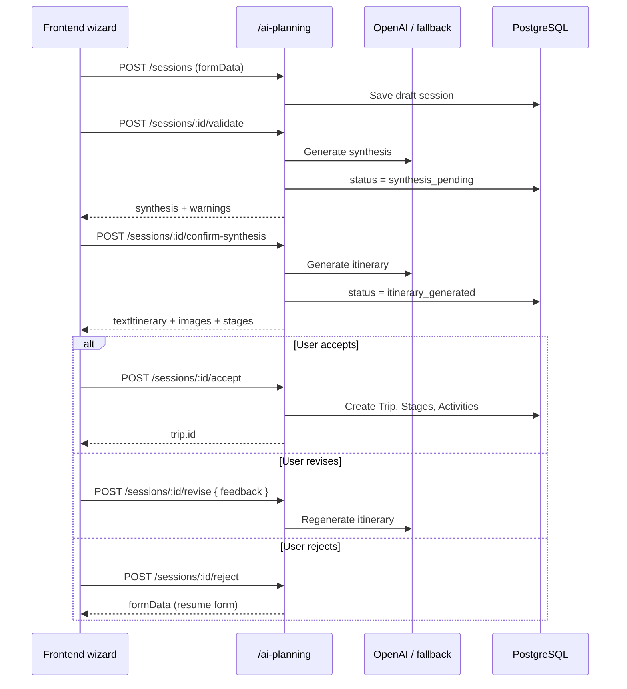

# API Reference

Base URL: `/api` (e.g. `http://localhost:3001/api` locally).

## Authentication

The API uses **session cookies** (`express-session`). After login, send cookies on subsequent requests (`credentials: 'include'` / axios `withCredentials: true`).

A JWT is also stored in the session and validated by `verifyToken` middleware on protected routes.

### Common error format

```json
{ "error": "Human-readable or i18n key message" }
```

---

## Health

### `GET /health`

No authentication required.

**Response 200:**

```json
{ "status": "ok" }
```

---

## Auth — `/auth`

### `POST /auth/register`

Create a new user.

**Body:**

```json
{
  "username": "jane",
  "password": "secret123",
  "name": "Jane Doe",
  "firstName": "Jane",
  "lastName": "Doe",
  "email": "jane@example.com"
}
```

| Field | Required | Notes |
|-------|----------|-------|
| `username` | Yes | Unique |
| `password` | Yes | Min 3 characters |
| `name` | No | Defaults to username |

**Response 201:** User object (no password).

**Errors:** `400` username exists, password too short; `500` server error.

---

### `POST /auth/login`

**Body:**

```json
{
  "username": "jane",
  "password": "secret123"
}
```

**Response 200:**

```json
{
  "id": 1,
  "username": "jane",
  "name": "Jane Doe",
  "firstName": "Jane",
  "lastName": "Doe",
  "email": "jane@example.com",
  "language": "en"
}
```

Sets session cookie. **Errors:** `401` invalid credentials.

---

### `GET /auth/verify`

Requires valid session.

**Response 200:** Same user shape as login.

**Errors:** `401` access denied; `404` user not found.

---

### `PUT /auth/profile`

Requires valid session.

**Body (partial):**

```json
{
  "name": "Jane D.",
  "firstName": "Jane",
  "lastName": "Doe",
  "email": "jane@example.com",
  "language": "fr"
}
```

**Response 200:** Updated user.

---

### `PUT /auth/change-password`

Requires valid session.

**Body:**

```json
{
  "currentPassword": "oldsecret",
  "newPassword": "newsecret123"
}
```

**Response 200:** `{ "message": "Password updated" }` (exact message may vary).

---

### `POST /auth/logout`

Destroys session.

**Response 200:** Success confirmation.

---

### `GET /auth/profiles`

List user profiles (public listing endpoint).

---

## Trips — `/trips`

### `GET /trips`

List all trips.

**Response 200:** Array of trip objects.

---

### `GET /trips/:id`

**Response 200:** Trip object.

**Errors:** `404` not found.

---

### `POST /trips`

**Body:**

```json
{
  "name": "South Africa 2025",
  "description": "Family safari",
  "startDate": "2025-01-10",
  "endDate": "2025-01-25",
  "userId": 1
}
```

**Response 200:** Created trip.

**Errors:** `400` `{ "error": "trip_name_exists" }`.

---

### `PUT /trips/:id`

Update trip fields. Name uniqueness enforced.

**Response 200:** Updated trip.

---

### `DELETE /trips/:id`

Deletes trip and related stages/activities (cascade logic in controller).

**Response 200:** Summary with deleted counts.

---

### `POST /trips/:id/import-csv`

Import activities from Travel Manager CSV export format.

**Body:**

```json
{
  "csvContent": "Stage,Activity,Type,...\n..."
}
```

**Response 200:** Import summary (stages/activities created).

---

## Stages — `/stages`

### `GET /stages/trip/:tripId`

Stages for a trip (with related data per controller includes).

---

### `GET /stages/:id`

Single stage by ID.

---

### `POST /stages`

**Body:**

```json
{
  "name": "Cape Town",
  "tripId": 1,
  "countryId": 1,
  "startDate": "2025-01-10",
  "endDate": "2025-01-14"
}
```

`countryId` is required for persistence.

---

### `PUT /stages/:id`

Update stage fields.

---

### `DELETE /stages/:id`

Delete stage (and related activities per business rules).

---

### `POST /stages/merge`

Merge consecutive stages.

**Body:**

```json
{
  "stageIds": [3, 4, 5]
}
```

**Response 200:** Merged stage result.

---

## Activities — `/activities`

### `GET /activities/stage/:stageId`

Activities for a stage.

---

### `GET /activities/timeline/:tripId`

Chronological timeline for entire trip.

---

### `GET /activities/analyze-duplicates/:tripId`

Duplicate detection report for trip activities.

---

### `GET /activities/:id`

Single activity.

---

### `POST /activities`

Create activity (type-specific nested fields for transport, accommodation, expense).

**Body (example):**

```json
{
  "name": "Flight to CPT",
  "stageId": 1,
  "activityTypeId": 1,
  "startDateTime": "2025-01-10T08:00:00.000Z",
  "endDateTime": "2025-01-10T12:00:00.000Z"
}
```

---

### `PUT /activities/:id`

Update activity; hotel date sync may update paired check-in/out records.

---

### `DELETE /activities/:id`

Delete activity.

---

### `POST /activities/structure-trip/:tripId`

Reorganize stages/activities based on dates (structure-trip helper).

---

## Import — `/import`

### `POST /import`

Import trip from ICS calendar content.

**Body:**

```json
{
  "icsContent": "BEGIN:VCALENDAR\n...",
  "tripId": 1,
  "tripName": "Imported trip",
  "userId": 1
}
```

| Field | Required | Notes |
|-------|----------|-------|
| `icsContent` | Yes | Raw ICS text |
| `tripId` | No | Update existing trip |
| `tripName` | No | Used when creating new trip |

**Response 200:** Trip with created stages/activities summary.

**Errors:** `400` missing ICS or invalid content; `404` trip not found.

---

## AI Import — `/ai-import`

### `POST /ai-import/analyze`

Multipart form upload.

| Field | Type | Notes |
|-------|------|-------|
| `document` | file | PDF, JPEG, PNG, or plain text; max 5 MB |
| `tripId` | field | Optional — enables match against existing activities |

**Response 200:** Analysis with `detectedActivities`, optional `potentialMatches`, proposed actions.

---

### `POST /ai-import/execute`

Apply approved actions from analysis.

**Body:** Action list from analyze step (structure defined by controller).

**Response 200:** Execution result (created/updated entities).

---

## AI Trip Planning — `/ai-planning`

AI-assisted **trip creation from user preferences**. Unlike `/ai-import` (which enriches an existing trip from uploaded documents), this flow:

1. Collects travel preferences via a form (zone, duration, style, transport, accommodation, budget).
2. Validates coherence and returns a **synthesis** for user confirmation.
3. Generates a **textual itinerary** with inspirational images.
4. On acceptance, creates a full **Trip** with **Stages** and **Activities**.

Sessions are persisted in `trip_planning_sessions` so users can resume later.

Authentication is **optional** (same pattern as most trip routes): if a session cookie is present, sessions are scoped to the logged-in user.

### Environment

| Variable | Required | Description |
|----------|----------|-------------|
| `USE_OPENAI` | No | `true` to use OpenAI for synthesis and itinerary |
| `OPENAI_API_KEY` | If OpenAI | API key from [platform.openai.com](https://platform.openai.com) |
| `OPENAI_MODEL` | No | Default `gpt-4o-mini` |

> **Note:** A ChatGPT Plus/Pro subscription does **not** include API access. A separate OpenAI API key is required. When OpenAI is disabled or unavailable, a rule-based fallback generates synthesis and itinerary.

### Session statuses

| Status | Meaning |
|--------|---------|
| `draft` | Form saved, not yet validated |
| `synthesis_pending` | Validation passed; synthesis shown, awaiting confirmation |
| `itinerary_generated` | Itinerary proposed to the user |
| `accepted` | User accepted; trip created (`tripId` set) |
| `rejected` | User rejected; form data retained |

### Form data shape

Used in `formData` on sessions and request bodies:

```json
{
  "geographicZone": "Provence, France",
  "durationDays": 7,
  "startDate": "2026-08-01",
  "travelStyle": "culturel et découverte",
  "localTransport": "voiture",
  "accommodationType": "hôtel",
  "budget": 2500,
  "currency": "EUR"
}
```

| Field | Required | Notes |
|-------|----------|-------|
| `geographicZone` | Yes | Region, country, or area |
| `durationDays` | Yes | Integer 1–90 |
| `startDate` | No | ISO date; flexible if omitted |
| `travelStyle` | Yes | e.g. cultural, beach, mountains, relaxation |
| `localTransport` | Yes | e.g. car, public transport, taxi |
| `accommodationType` | Yes | e.g. hotel, Airbnb, camping |
| `budget` | Yes | Total estimated budget (> 0) |
| `currency` | Yes | ISO 4217 code (e.g. `EUR`) |

---

### `GET /ai-planning/sessions`

List planning sessions for the current user (or all sessions if unauthenticated).

**Response 200:** Array of session objects (newest first, max 50).

```json
[
  {
    "id": 1,
    "userId": 1,
    "status": "itinerary_generated",
    "formData": { "geographicZone": "Provence, France", "durationDays": 7 },
    "synthesis": { "title": "...", "summary": "...", "warnings": [] },
    "itinerary": { "title": "...", "textItinerary": "...", "images": [] },
    "revisionCount": 0,
    "tripId": null,
    "createdAt": "2026-07-14T10:00:00.000Z",
    "updatedAt": "2026-07-14T10:05:00.000Z"
  }
]
```

---

### `GET /ai-planning/sessions/:id`

Retrieve a single planning session.

**Response 200:** Session object.

**Errors:** `404` session not found.

---

### `POST /ai-planning/sessions`

Create or update a session with form data (step 1 — save draft).

**Body:**

```json
{
  "sessionId": 1,
  "formData": {
    "geographicZone": "Provence, France",
    "durationDays": 7,
    "travelStyle": "culturel",
    "localTransport": "voiture",
    "accommodationType": "hôtel",
    "budget": 2500,
    "currency": "EUR"
  }
}
```

| Field | Required | Notes |
|-------|----------|-------|
| `formData` | Yes | Preferences (see shape above) |
| `sessionId` | No | If provided, updates existing session and resets synthesis/itinerary |

**Response 200:** Saved session with `status: "draft"`.

---

### `POST /ai-planning/sessions/:id/validate`

Validate form coherence and generate a **synthesis** (step 2).

**Body (optional):**

```json
{
  "formData": { "...": "overrides session formData if provided" }
}
```

**Response 200:**

```json
{
  "success": true,
  "validation": {
    "isValid": true,
    "formData": { "...": "..." },
    "errors": [],
    "warnings": ["Le budget journalier est très serré..."]
  },
  "synthesis": {
    "title": "Voyage Provence, France",
    "summary": "Destination : Provence...",
    "highlights": ["culturel", "voiture", "hôtel"],
    "warnings": [],
    "estimatedDailyBudget": 357,
    "source": "openai"
  },
  "sessionId": 1,
  "requiresConfirmation": true
}
```

**Response 400** (validation failed — user must correct the form):

```json
{
  "success": false,
  "validation": {
    "isValid": false,
    "errors": ["La zone géographique est requise..."],
    "warnings": []
  },
  "requiresFormCorrection": true
}
```

---

### `POST /ai-planning/sessions/:id/confirm-synthesis`

User confirmed the synthesis; generate the full **itinerary** (step 3).

**Body:** Empty or `{}`.

**Response 200:**

```json
{
  "success": true,
  "itinerary": {
    "title": "Voyage Provence, France",
    "textItinerary": "# Itinéraire proposé...",
    "images": [
      { "url": "https://picsum.photos/seed/Provence-0/800/400", "caption": "Provence" }
    ],
    "transportRoute": "Trajet vers Provence. Sur place : voiture.",
    "trip": {
      "name": "Voyage Provence, France (7j)",
      "description": "...",
      "startDate": "2026-08-01",
      "endDate": "2026-08-07",
      "budget": 2500,
      "currency": "EUR"
    },
    "stages": [
      {
        "name": "Aix-en-Provence",
        "countryCode": "FR",
        "startDate": "2026-08-01",
        "endDate": "2026-08-03",
        "activities": [
          {
            "name": "Visite du centre historique",
            "activityType": "tour",
            "startDateTime": "2026-08-01T09:00:00Z",
            "endDateTime": "2026-08-01T18:00:00Z",
            "city": "Aix-en-Provence"
          }
        ],
        "accommodations": [
          {
            "name": "Hôtel Le Pavillon — Aix-en-Provence",
            "type": "hôtel",
            "checkInDate": "2026-08-01",
            "checkOutDate": "2026-08-04",
            "estimatedCost": 450
          }
        ]
      }
    ],
    "source": "openai"
  },
  "sessionId": 1
}
```

**Errors:** `400` synthesis not available (validate first).

---

### `POST /ai-planning/sessions/:id/revise`

Request a revised itinerary with user feedback.

**Body:**

```json
{
  "feedback": "Moins de musées, plus de temps à la plage, budget hébergement plus bas"
}
```

**Response 200:** New `itinerary` object and incremented `revisionCount`.

**Errors:** `400` missing feedback.

---

### `POST /ai-planning/sessions/:id/accept`

Accept the proposed itinerary and **create the trip** in Travel Manager (Trip → Stages → Activities).

**Body:** Empty or `{}`.

**Response 200:**

```json
{
  "success": true,
  "trip": {
    "id": 42,
    "name": "Voyage Provence, France (7j)",
    "startDate": "2026-08-01",
    "endDate": "2026-08-07",
    "budget": 2500,
    "currency": "EUR"
  },
  "message": "Voyage créé avec succès"
}
```

Hotel suggestions from the itinerary are created as **Hotel** activities (type id 7). Day activities map to activity types (`museum`, `tour`, `restaurant`, etc.).

**Errors:** `400` no itinerary to accept.

---

### `POST /ai-planning/sessions/:id/reject`

Reject the itinerary and return to the form. Form data is **retained** in the session.

**Response 200:**

```json
{
  "success": true,
  "formData": { "...": "original preferences" },
  "sessionId": 1
}
```

---

### Planning workflow (summary)



---

## Reference data CRUD

The following resources share the same REST pattern:

| Base path | Model |
|-----------|-------|
| `/countries` | Countries (+ translations) |
| `/languages` | Languages |
| `/activity-types` | Activity types |
| `/transport-types` | Transport types |
| `/accommodation-types` | Accommodation types |
| `/expense-categories` | Expense categories |
| `/notification-types` | Notification types |

### Standard operations

| Method | Path | Action |
|--------|------|--------|
| `GET` | `/` | List all |
| `POST` | `/` | Create |
| `PUT` | `/:id` | Update |
| `DELETE` | `/:id` | Delete |

### `GET /countries`

Supports optional `lang` query for translated names (see controller).

---

## HTTP status summary

| Code | Usage |
|------|-------|
| 200 | Success |
| 201 | Created (register) |
| 400 | Validation / bad input |
| 401 | Not authenticated |
| 404 | Resource not found |
| 500 | Server error |

---

## CORS

Allowed origins: `CORS_ORIGINS` env list plus `*.vercel.app` and `*.onrender.com` in production. Credentials supported.

Methods: `GET`, `POST`, `PUT`, `DELETE`, `OPTIONS`.

---

## Example: authenticated flow with curl

```bash
# Register
curl -c cookies.txt -X POST http://localhost:3001/api/auth/register \
  -H "Content-Type: application/json" \
  -d '{"username":"demo","password":"demo1234","name":"Demo"}'

# Login
curl -b cookies.txt -c cookies.txt -X POST http://localhost:3001/api/auth/login \
  -H "Content-Type: application/json" \
  -d '{"username":"demo","password":"demo1234"}'

# List trips
curl -b cookies.txt http://localhost:3001/api/trips
```

---

## Related documentation

- [05-developer-guide.md](05-developer-guide.md) — local setup
- [01-architecture.md](01-architecture.md) — auth and import flows
- [02-source-code-structure.md](02-source-code-structure.md) — controller source files
