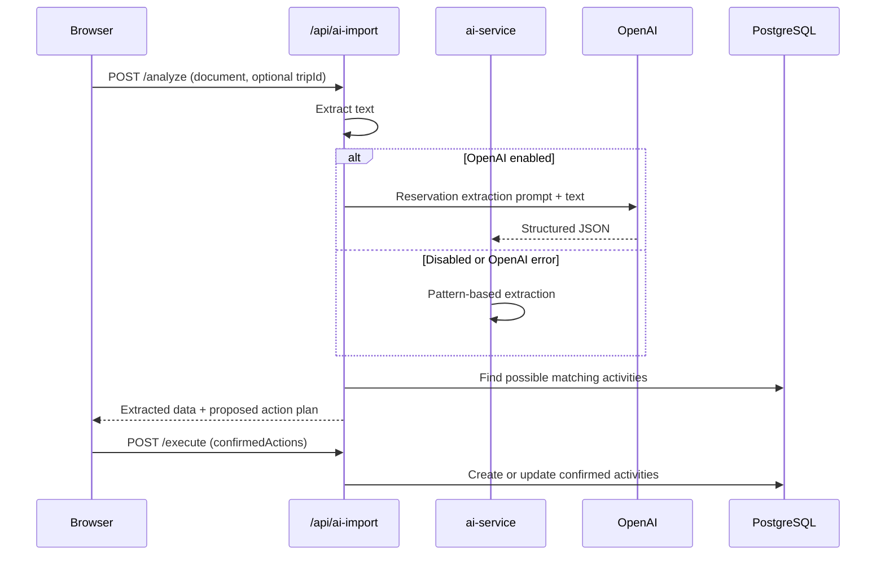

# AI Integration

## Overview

Travel Manager uses OpenAI as an optional enhancement for three separate workflows. The backend remains usable when OpenAI is disabled: document import uses pattern matching, trip planning uses deterministic generators, and trip adaptation returns an empty fallback proposal.

| Feature | API base path | Backend entry point | OpenAI model | Fallback |
|---------|---------------|---------------------|--------------|----------|
| Reservation document import | `/api/ai-import` | `utils/ai-service.js` | `gpt-3.5-turbo` (fixed in code) | Regular-expression extraction |
| New trip planning | `/api/ai-planning` | `utils/ai-planning-service.js` | `OPENAI_MODEL` | Rule-based synthesis and itinerary |
| Existing trip adaptation | `/api/ai-adapt` | `utils/ai-adapt-service.js` | `OPENAI_MODEL` | Empty proposal with `source: "fallback"` |

All OpenAI calls use the Chat Completions API. Planning and adaptation request JSON output explicitly and persist their interactions for administrator review.

## Runtime configuration

Configure the backend in `travelmgr-backend/.env` for local development, or define the same variables in the deployment environment. Start from `travelmgr-backend/.env.example`; never commit a real API key.

```dotenv
USE_OPENAI=true
OPENAI_API_KEY=sk-...
OPENAI_MODEL=gpt-4o-mini

# Optional prompt configuration overrides
AI_PLANNING_PROMPTS_PATH=/absolute/path/to/ai-planning-prompts.json
AI_ADAPT_PROMPTS_PATH=/absolute/path/to/ai-adapt-prompts.json
ACTIVITY_INSPIRATION_SITES_PATH=/absolute/path/to/activity-inspiration-sites.json
```

| Variable | Required | Purpose |
|----------|----------|---------|
| `USE_OPENAI` | Yes for OpenAI | Must be the exact string `true`; any other value disables OpenAI. |
| `OPENAI_API_KEY` | Yes for OpenAI | API key used by the official `openai` Node.js client. A ChatGPT subscription does not provide API access. |
| `OPENAI_MODEL` | No | Planning and adaptation model; defaults to `gpt-4o-mini`. It does not currently affect document import. |
| `AI_PLANNING_PROMPTS_PATH` | No | Overrides the default planning prompt file. |
| `AI_ADAPT_PROMPTS_PATH` | No | Overrides the default adaptation prompt file. |
| `ACTIVITY_INSPIRATION_SITES_PATH` | No | Overrides the activity-site catalogue injected into planning prompts. |

The three optional path variables are read by Node.js. Prefer absolute paths, especially in Docker and hosted environments. If a relative path is used, it is resolved from the backend process working directory, not from the source file containing the loader.

After changing environment variables, restart the backend. JSON prompt files are cached by modification time and are reloaded on a later request after the file changes; a process restart is normally unnecessary for prompt-only edits.

## Interaction flows

### Reservation document import



The upload accepts one PDF, JPEG, PNG, or plain-text file up to 5 MB. PDF parsing and image OCR are currently placeholders; only plain text is decoded from the uploaded file. Users must confirm proposed actions before database changes are applied.

The OpenAI request uses `gpt-3.5-turbo`, temperature `0.1`, and a maximum of 1,000 tokens. If the request or JSON parsing fails, the service silently falls back to pattern extraction. This workflow does not write to the AI interaction log.

### New trip planning

1. `POST /api/ai-planning/sessions` saves normalized form preferences as a draft.
2. `POST /api/ai-planning/sessions/:id/validate` validates the preferences and generates a synthesis.
3. The user confirms the synthesis with `POST /api/ai-planning/sessions/:id/confirm-synthesis`, which generates the full itinerary.
4. `POST /api/ai-planning/sessions/:id/revise` sends the feedback and previous itinerary through the itinerary prompt again.
5. `POST /api/ai-planning/sessions/:id/accept` creates the trip, stages, transport activities, activities, and accommodation records. Rejecting clears the generated content while retaining the form data.

Planning sends a system message plus a generated user prompt. The request uses temperature `0.4`, a maximum of 6,000 tokens, and `response_format: { "type": "json_object" }`. The backend normalizes the response and supplements invalid or unavailable OpenAI output with its deterministic planning logic.

The response language comes from the authenticated user's language, with French as the default. Supported prompt language labels are English, French, Spanish, and Dutch.

### Existing trip adaptation

1. `POST /api/ai-adapt/trips/:tripId/start` captures a database snapshot and creates an adaptation session.
2. `POST /api/ai-adapt/sessions/:id/propose` combines the compact trip snapshot with the user's `adaptationRequest` and asks OpenAI for create, update, and delete operations.
3. The backend normalizes the response, identifies impacts on reserved items, and validates accommodation coverage.
4. `POST /api/ai-adapt/sessions/:id/accept` applies the proposal and fills accommodation gaps when possible. `reject` leaves the trip unchanged.

`POST /api/ai-adapt/trips/:tripId/resolve-consistency` uses the same proposal flow with an automatically generated request based on consistency errors and warnings.

Adaptation uses temperature `0.3`, a maximum of 6,000 tokens, and JSON response format. When OpenAI is disabled, the proposal contains no changes and reports `source: "fallback"`; unlike planning, no rule-based adaptations are generated.

## Prompt configuration

### Planning prompts

The default configuration is `travelmgr-backend/config/ai-planning-prompts.json`. It contains:

| Key | Role |
|-----|------|
| `systemMessage` | System role, JSON-only behavior, and output-language requirement |
| `languageInstruction` | Language constraint inserted into the user prompt |
| `baseContextIntro` and `formFieldLines` | User preference context |
| `synthesisInstructions` and `synthesisJsonSchema` | Synthesis task and required result shape |
| `itineraryInstructions`, `itineraryJsonSchema`, and `itineraryRules` | Itinerary task, schema, and business constraints |
| `revisionBlockTemplate` | Feedback and previous itinerary included during revision |

`utils/ai-planning-prompts.js` renders `{{variableName}}` placeholders. Available values include form fields such as `departureLocation`, `geographicZone`, `durationDays`, `startDate`, `travelStyle`, `localTransport`, `accommodationType`, `budget`, `currency`, activity-hour limits, `remarks`, the selected inspiration sites, `languageLabel`, `revisionFeedback`, and `previousItinerary`.

Unknown placeholders and null values render as empty strings. Keep JSON schemas inside JSON strings escaped correctly (`\n`, `\"`) and validate the configuration after every edit.

### Adaptation prompts

The default configuration is `travelmgr-backend/config/ai-adapt-prompts.json`. Its main keys are `systemMessage`, `languageInstruction`, `proposeInstructions`, and `proposeJsonSchema`. `utils/ai-adapt-service.js` adds the compact trip snapshot and the user's request around these configured fragments.

The configured templates currently use `{{languageLabel}}`. The trip data and adaptation request are inserted by the service rather than declared as template variables.

### Activity inspiration sites

`travelmgr-backend/config/activity-inspiration-sites.json` defines the supported providers, defaults, and URL templates. The selected provider names are inserted into planning prompts. URL templates use `{{query}}`, which is URL-encoded by the application.

The model is not given browsing or retrieval tools: inspiration-site names are prompt hints only. Any generated venue, schedule, price, coordinate, or booking URL remains a suggestion and must be verified before booking.

### Document-import prompt

The reservation extraction prompt is currently hard-coded in `travelmgr-backend/utils/ai-service.js` inside `analyzeWithOpenAI()`. Edit that function to change its instructions or output schema. Unlike planning and adaptation, it has no JSON configuration file, model override, hot reload, or interaction logging.

## Safe prompt-editing procedure

1. Copy the relevant JSON file and set its `AI_*_PROMPTS_PATH` variable when experimenting without changing repository defaults.
2. Preserve every property required by the response normalizers and persistence code. Removing required dates, entity identifiers, stage identifiers, or nested `trip`/`stages` data can produce incomplete proposals.
3. Keep the instruction to return JSON only and keep the declared schema compatible with the code.
4. Treat user remarks, revision feedback, uploaded text, and trip snapshots as untrusted prompt content. Do not add instructions that expose secrets or execute model-provided commands.
5. Test synthesis, initial itinerary, revision, and fallback paths. For adaptation, also test reserved items and accommodation coverage.
6. Review the full rendered prompt and parsed response through the admin AI log before deploying the change.

## Logging and privacy

Planning and adaptation calls are stored in `ai_interaction_logs` through `utils/ai-interaction-logger.js`. Successful records can include the model, complete system and user prompts, request messages and payload, raw and parsed responses, token usage, user/session/trip references, and status. Failed calls store the prompts and error message.

Administrators can list logs through `GET /api/admin/ai-logs` and inspect a complete record with `GET /api/admin/ai-logs/:id`. List responses omit the large prompt and response fields; detail responses include them.

Prompts may contain travel dates, locations, reservation details, and user-written text. Restrict administrator access, define an appropriate retention policy, avoid putting secrets in user fields or prompt files, and account for OpenAI data processing requirements in the deployment's privacy policy.

## Failure behavior and troubleshooting

| Symptom | Check |
|---------|-------|
| OpenAI is never called | Confirm both `USE_OPENAI=true` and a non-empty `OPENAI_API_KEY`, then restart the backend. |
| Planning/adaptation uses the wrong model | Check `OPENAI_MODEL`; document import intentionally ignores it. |
| Prompt configuration fails to load | Check that the path is visible inside the running container and that the file contains valid UTF-8 JSON. |
| Planning returns fallback output | Review backend errors and `/api/admin/ai-logs`; OpenAI/network/JSON failures trigger fallback generation. |
| Adaptation returns no changes | OpenAI is disabled, or the proposal is empty. Adaptation has no generated fallback changes. |
| Document extraction is inaccurate | Use a text file for real extraction; PDF and image extraction are placeholders. Pattern extraction is intentionally limited. |
| Output contains unsupported values | Align the prompt schema with the normalization and database mapping in the corresponding service. |

## Related documentation

- [Architecture](01-architecture.md#ai-trip-planning)
- [Developer guide](05-developer-guide.md#ai-trip-planning-local)
- [API reference](07-api-reference.md#ai-trip-planning--ai-planning)
- [Trip consistency rules](trip-consistency-rules.md)
