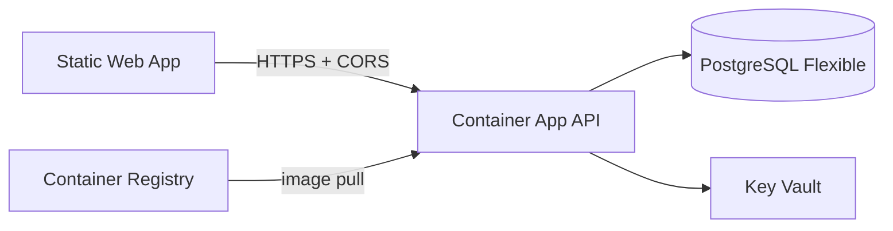

# Azure infrastructure (Travel Manager)

Bicep templates for Azure hosting (Container Apps API, Static Web Apps frontend, PostgreSQL Flexible Server, ACR, Key Vault).

## Layout

| Path | Purpose |
|------|---------|
| `main.bicep` | Resource group deployment orchestrator |
| `dev.bicepparam` | Non-secret defaults for **dev** (secure params passed at deploy time) |
| `modules/` | Log Analytics, identity, ACR, PostgreSQL, Key Vault, Container Apps, Static Web App |

## Dev topology



## Deploy (recommended)

From the repository root:

```powershell
.\tools\azure\deploy-infra-p1.ps1 -Environment dev
```

The script:

1. Deploys base infra (ACR, PostgreSQL, Key Vault, Static Web App, Log Analytics, identity).
2. Builds and pushes the API image to ACR (`travel-manager-api:bootstrap`).
3. Redeploys with the Container App wired to the image and SWA URL for `CORS_ORIGINS` / `FRONTEND_URL`.

Some subscriptions cannot create new resources in `westeurope`. Default region is **`francecentral`**; override with `-Location` if needed ([region eligibility](https://aka.ms/locationineligible)). Static Web Apps use **`westus2`** by default (`staticWebAppLocation` in Bicep) because SWA regions are limited.

Requires Azure CLI, `az login`, and permission to create resources and role assignments. If **ACR Tasks** are disabled on the subscription, the deploy script falls back to local **Docker** build and push.

## Manual deploy

```powershell
$rg = 'rg-travelmgr-dev'
az group create -n $rg -l westeurope -o none

az deployment group create `
  -g $rg `
  -f infra/azure/main.bicep `
  -p infra/azure/dev.bicepparam `
  -p postgresAdminPassword='...' appSecret='...'
```

Set `deployContainerApp=true` and pass `containerImage`, `corsOrigins`, and `frontendUrl` only after the API image exists in ACR.

## Naming (dev)

| Resource | Name |
|----------|------|
| Resource group | `rg-travelmgr-dev` |
| ACR | `travelmgrdevacr` |
| API Container App | `travelmgr-dev-api` |
| PostgreSQL | `travelmgr-dev-psql` |
| Key Vault | `travelmgr-dev-kv` |
| Static Web App | `travelmgrdevweb` |

## Next phases

- **P2**: CI parity with GitHub Actions + SonarCloud in Azure Pipelines.
- **P3**: CD deploy API + SWA from the pipeline using `sc-azure-travelmgr` (OIDC).
